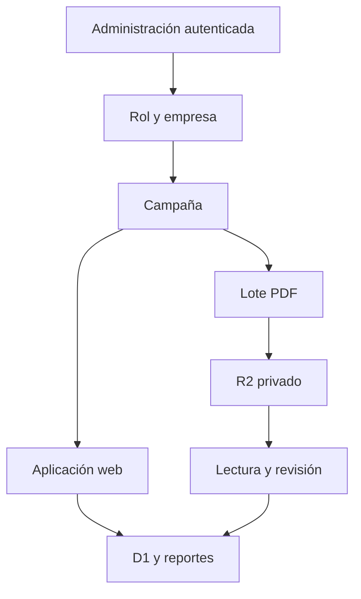

# Arquitectura

- `app/`: páginas y rutas HTTP.
- `components/`: interfaz reusable.
- `lib/auth.ts`: identidad, roles y alcance.
- `lib/security.ts`: CSRF, hashing, tokens, origen y CSV.
- `lib/instruments.ts`: definición demo reemplazable.
- `lib/scoring.ts`: cálculo puro y agregación.
- `lib/batches.ts`: límites, PDF, Drive, normalización y compatibilidad.
- `lib/openai-extraction.ts`: lectura PDF con salida estructurada y sin retención de respuesta.
- `db/` y `drizzle/`: esquema, acceso y migración.
- `worker/`: entrada y cabeceras de seguridad.

Las Formas A y B se fijan al invitar y nunca se agregan juntas. Solo superadministración y psicología/SST ven resultados individuales. Administración de empresa y consulta quedan limitadas a su organización.

Los lotes usan D1 para estados y matrices, y R2 para los PDF originales. La carga admite archivos locales y enlaces individuales de Google Drive; el servidor valida firma, tamaño, dominio y redirecciones antes de persistir. La lectura automática nunca confirma un resultado: genera un borrador con confianza por documento e ítem. Solo la revisión autenticada puede tabular, y solo una plantilla compatible puede crear una entrega calificable.
