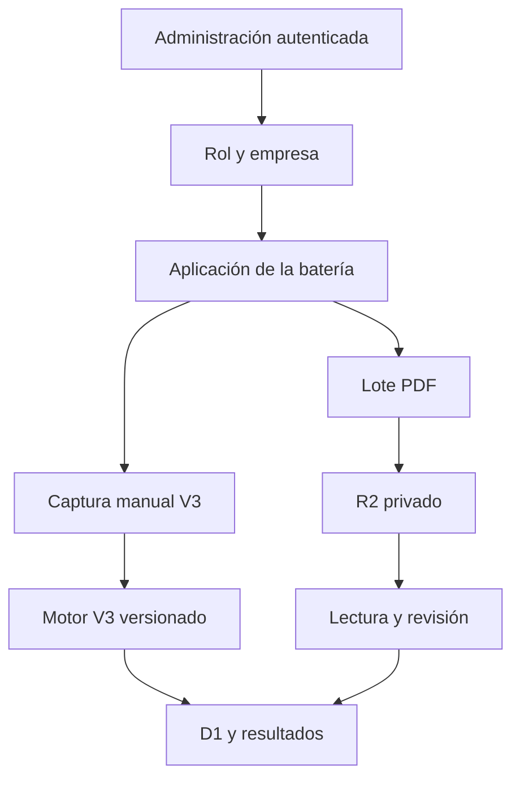

# Arquitectura

- `app/`: páginas y rutas HTTP.
- `components/`: interfaz reusable.
- `lib/auth.ts`: identidad, roles y alcance.
- `lib/security.ts`: CSRF, sesiones firmadas, tokens, origen y CSV.
- `lib/passwords.ts`: política, derivación PBKDF2 y verificación de contraseñas complementarias.
- `lib/instruments.ts`: definición demo reemplazable.
- `lib/v3.ts`: estructura, escalas, filtros y controles de completitud V3.
- `lib/scoring.ts`: cálculo del banco digital demostrativo.
- `lib/v3-scoring.ts` y `lib/v3-scoring-data.ts`: motor manual V3, claves, factores y baremos versionados.
- `lib/batches.ts`: límites, PDF, Drive, normalización y compatibilidad.
- `lib/openai-extraction.ts`: lectura PDF con salida estructurada y sin retención de respuesta.
- `db/` y `drizzle/`: esquema, acceso y migración.
- `worker/`: entrada y cabeceras de seguridad.

Las Formas A y B se fijan por nivel ocupacional y nunca se agregan juntas. Solo superadministración y psicología/SST acceden a la captura manual y a resultados individuales. Administración de empresa y consulta quedan limitadas a su organización.

Los lotes usan D1 para estados y matrices, y R2 para los PDF originales. La carga admite archivos locales y enlaces individuales de Google Drive; el servidor valida firma, tamaño, dominio y redirecciones antes de persistir. La lectura automática nunca confirma un resultado: genera un borrador con confianza por documento e ítem. La calificación oficial se aplica al registro manual completo; el OCR permanece como pretabulación hasta validar una plantilla que distinga los cuatro instrumentos.
